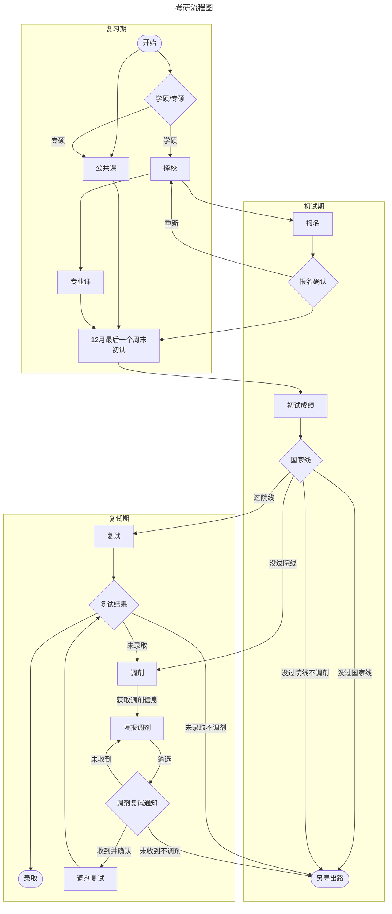

# yztool

极简的中国研究生招生信息网（研招网，yz.chsi.com.cn）信息抓取工具。利用 xpath 抓取静态数据。

## 安装

仅需 Python，和 request、lxml（xpath 库）两个包即可运行

生成 json 格式数据文件，便于转换为其他数据格式。

## 待办（Todo）

- [x] 获取硕士目录数据（master_cat）
  - [ ] 根据网页变动，自动去除换行和空白；
  - [ ] 提供生成csv, xlsx等表格文件功能；
- [ ] 科目分析（wordart）
- [ ] 大纲转思维导图（使用mermaid.js）
- [ ] 获取/推送复试分数线
- [ ] 获取复试名单
- [ ] 根据硕士目录拟招信息和复试名单信息，分析缺额
- [ ] 获取调剂公告
- [ ] 获取拟录取名单

## 主体

### 流程

在中国，硕士研究生招生工作是按如下流程进行的：

>设今年为x年，入学时间为x+1年9月因此有

x年9月，教育部关于印发《x+1年全国硕士研究生招生工作管理规定》的通知

>全国硕士研究生招生考试分初试和复试两个阶段进行。初试和复试都是硕士研究生招生考试的重要组成部分。初试由国家统一组织，复试由招生单位自行组织。
>
>初试方式分为全国统一考试（含联合考试）、单独考试以及推荐免试。

- 全国统一考试（含联合考试）简称全国统考，或统考。部分或全部考试科目由教育部教育考试院（原教育部考试中心，下同）负责统一命题，其他考试科目由招生单位自行命题。
- 单独考试由具有单独考试资格的招生单位进行，考生须符合特定报名条件，考试科目由招生单位单独命题、委托其他招生单位命题或选用全国统一命制试题。
- 推荐免试，即常说的保研，也简称推免

初试阶段

- 报名
- 确认
- 初试
- 查看成绩

复试阶段

- 国家线与自划线
- 进入复试名单（也称院线）
- 复试
- 查看复试成绩
- 调剂
  - 查看调剂缺额
  - 调剂志愿与调剂复试通知
  - 调剂复试
  - 待录取通知
- 拟录取公示

## 思路

研招网

- 博士目录抓取（按学校代码进行请求即可获取，仅需解决页数获取问题）
- 考研（硕士研究生入学考试）复试分数（历年数据）

非研招网

- 抓取招生单位研究生院官网、招生信息网、培养单位官网等信息（通过搜索引擎请求，部分获取质量差）
- 抓取招生单位官方微信公众号、研究生院公众号、培养单位或其研究生学生会公众号（通过“搜狗搜索-微信”请求）
- 监控“研究生招生信息发布”更新情况（通过计算新旧网页信息差异度进行报告）

## 其他说明

本项目非常简陋，为个人练手，还请大佬们多 PR，多交流。

在具体使用层面，github 上还有很多其他类似的以研招网为目标的信息抓取、梳理、分析工具，因受我个人能力所限而没能提供的图形化界面（UI）、健壮性（Robustness）输入输出（I/O）都有提供。

## 数据来源

- 主体数据：[中国研究生招生信息网](https://yz.chsi.com.cn)
- 院校代码：[全国高等院校名单（未含港澳台）-中国教育部](https://hudong.moe.gov.cn/qggxmd/)
- 学科代码：[研究生教育专业学科目录（2022 年版）](http://www.moe.gov.cn/srcsite/A22/moe_833/202209/t20220914_660828.html)
  - 旧学科代码：[学位授予和人才培养学科目录（2018 年 4 月更新）](http://www.moe.gov.cn/jyb_sjzl/ziliao/A22/201804/t20180419_333655.html)
